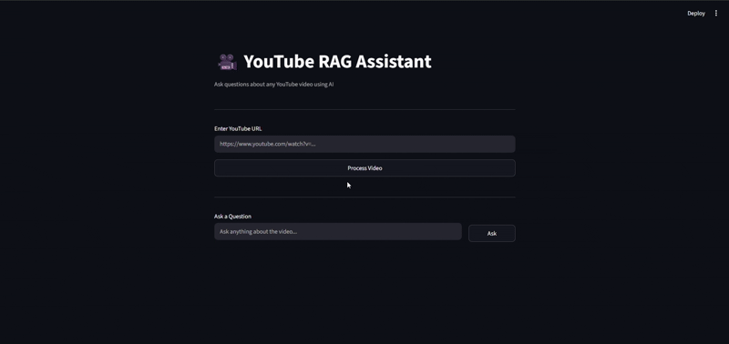

# 🎥 YouTube RAG Assistant

An end-to-end AI system that allows users to ask questions about any YouTube video using Retrieval-Augmented Generation (RAG).  
It extracts video content, converts speech to text, stores embeddings in a vector database, and uses an LLM to generate intelligent answers based on the video.

---

## 📸 Demo
<p align="center">
  
</p>

---

## 🚀 Features

- 🔗 Input any YouTube video URL  
- 🎧 Extract audio using `yt-dlp`  
- 🧠 Transcribe speech using Faster Whisper  
- ✂️ Chunk transcript using LangChain text splitters  
- 🤗 Generate embeddings using SentenceTransformers  
- 🗄️ Store embeddings in ChromaDB  
- 🔍 Semantic retrieval of relevant video context  
- 🤖 Answer generation using Google Gemini AI  
- 💬 Interactive UI built with Streamlit  

---

## 🧠 Architecture

```
YouTube Video  
↓  
Audio Extraction (yt-dlp)  
↓  
Speech-to-Text (Whisper)  
↓  
Text Chunking  
↓  
Embeddings (SentenceTransformers)  
↓  
Vector Database (ChromaDB)  
↓  
Retrieval (Semantic Search)  
↓  
LLM (Gemini)  
↓  
Final Answer  
```

---

## 🛠️ Tech Stack

- Python  
- Streamlit  
- yt-dlp  
- Faster Whisper  
- LangChain Text Splitters  
- SentenceTransformers  
- ChromaDB  
- Google Gemini API  

---

## 📁 Project Structure

```bash
youtube-rag-assistant/
│
├── app.py                 # Streamlit UI
├── main.py                # Optional backend test runner
│
├── src/
│   ├── downloader.py      # YouTube audio extraction
│   ├── transcriber.py     # Whisper transcription
│   ├── chunker.py         # Text chunking
│   ├── embeddings.py      # Embedding generation
│   ├── vectordb.py        # ChromaDB storage & retrieval
│   ├── retriever.py       # Query retrieval logic
│   ├── rag_pipeline.py    # Main pipeline orchestration
│   ├── llm.py             # Gemini LLM integration
│   └── config.py          # Config & paths
│
├── data/                  # Downloaded audio files
├── vectorstore/           # ChromaDB storage
├── assets/                # UI screenshots / diagrams
│
├── .env                   # API keys
├── .env.example
├── requirements.txt
└── README.md
```

---

## ⚙️ How It Works

1. User pastes a YouTube URL  
2. Audio is extracted using `yt-dlp`  
3. Whisper converts speech → text  
4. Transcript is split into overlapping chunks  
5. Each chunk is converted into embeddings  
6. Embeddings are stored in ChromaDB  
7. User asks a question  
8. Relevant chunks are retrieved  
9. Gemini generates a contextual answer  

---

## ▶️ How to Run

### 1. Clone repository

```bash
git clone https://github.com/your-username/youtube-rag-assistant
cd youtube-rag-assistant
```

### 2. Create virtual environment

```bash
python -m venv venv
venv\Scripts\activate
```

### 3. Install dependencies

```bash
pip install -r requirements.txt
```

### 4. Add API key

Create a `.env` file in the root directory:

```env
GEMINI_API_KEY=your_api_key_here
```

### 5. Run the app

```bash
streamlit run app.py
```